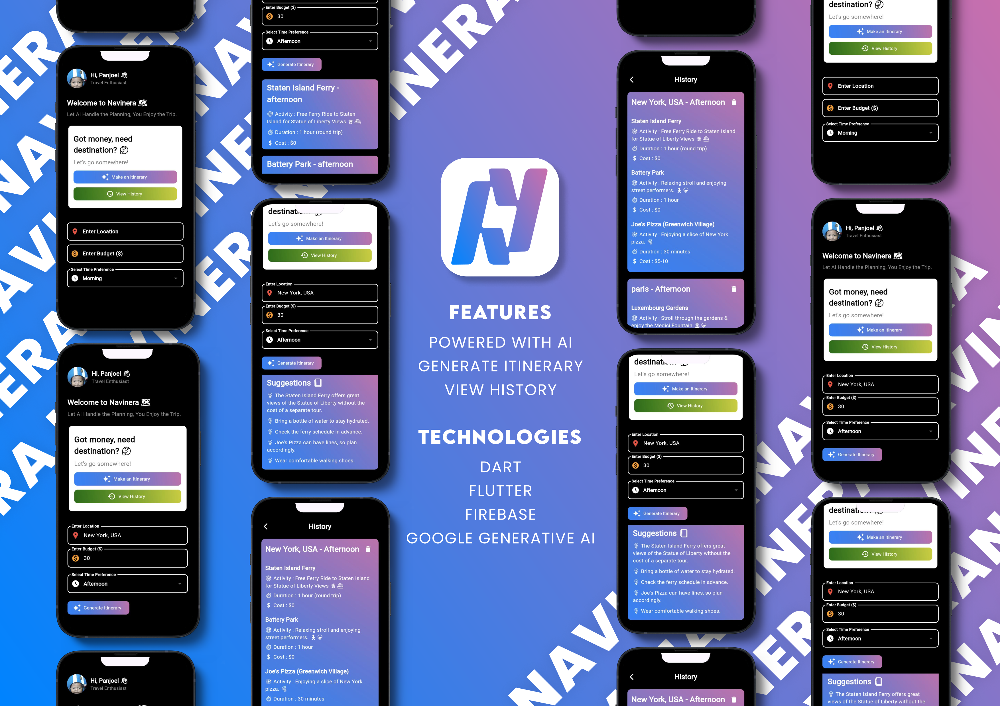

# 🌍 Navinera - AI-Powered Itinerary Generator

Welcome to **Navinera**, your smart travel companion! 🚀
Navinera leverages **Flutter**, **Google Generative AI**, and **Gemini API** to create personalized travel itineraries based on your preferences, time, and budget.

---

## 📋 Features

### ✈️ **AI-Generated Itineraries**
- Uses **Google Generative AI** to suggest optimized travel plans.
- Customizable based on **location, time, and budget**.

### 🏝 **Smart Destination Recommendations**
- Discover unique places tailored to your interests.
- Provides insights on attractions, activities, and estimated costs.

### 🕒 **Schedule Optimization**
- Divides plans into **Morning, Afternoon, and Evening** sections.
- Ensures an efficient and enjoyable travel experience.

### 📜 **Itinerary History**
- Save and view past itineraries for easy reference.

### 🗑 **Manage & Delete Itineraries**
- Easily delete unwanted itineraries to keep things organized.

---

## 🚀 Technologies Used

Navinera is powered by cutting-edge technologies:

- **Developed with:**
  - Dart & Flutter

- **Core Dependencies:**
  - [`firebase_core`](https://pub.dev/packages/firebase_core) - Firebase integration.
  - [`cloud_firestore`](https://pub.dev/packages/cloud_firestore) - Store and manage itinerary history.
  - [`http`](https://pub.dev/packages/http) - API calls to **Gemini AI**.
  - [`google_generative_ai`](https://pub.dev/packages/google_generative_ai) - Access Google Gemini AI for travel insights.

---

## 🎯 Why Choose Navinera?

With **Navinera**, planning trips has never been easier! Whether you're a solo traveler or planning with friends, let AI handle the heavy lifting. 🌎✨

📌 **Personalized** | 🤖 **AI-Powered** | 🏞 **Smart Suggestions** | 🔥 **Efficient Planning**

---

## 📸 Screenshots

Check out Navinera in action:

---

Happy Traveling! ✈️🌍
